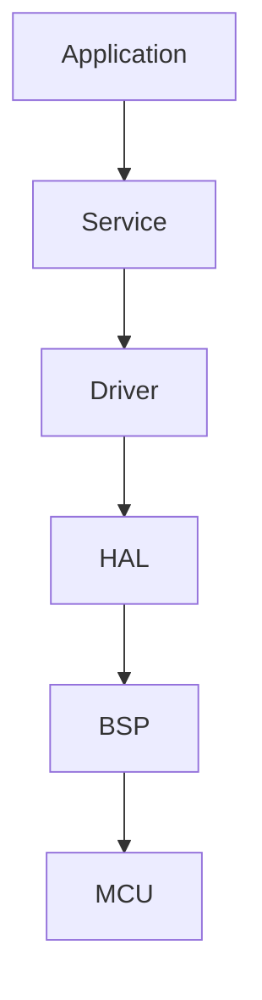
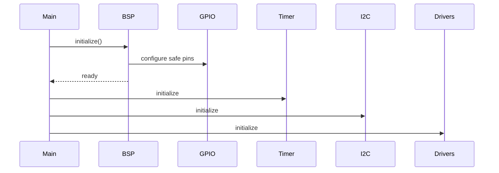
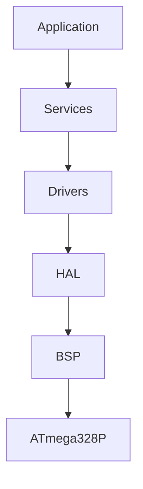
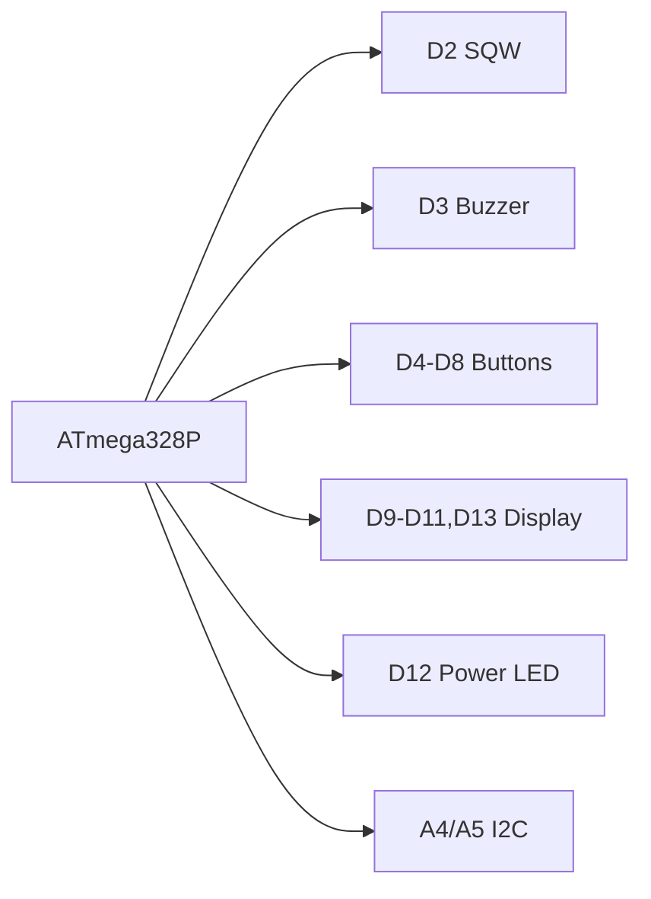

# PROMPT_24_Board_BSP.md

````md
# Vibe Coding Prompt
# Module Implementation: Board BSP

Anda adalah **Senior Embedded Firmware Engineer** yang bertanggung jawab membuat firmware production-grade untuk project:

# Operation Timer Embedded System

Target hardware:

- Arduino Nano
- ATmega328P
- PlatformIO
- Arduino Framework

---

# Task

Implementasikan modul:

```text
Board BSP
````

BSP (**Board Support Package**) menjadi abstraction layer yang mendefinisikan karakteristik hardware board dan konfigurasi board-specific.

BSP harus menjadi satu-satunya tempat untuk mendefinisikan:

* board identity
* hardware revision
* pin mapping
* peripheral configuration
* electrical polarity
* board-level constants
* timer/resource ownership
* hardware capability

Tujuannya adalah memisahkan:

```text
Application / Service
        |
        v
Driver / HAL
        |
        v
BSP
        |
        v
ATmega328P Hardware
```

---

# Primary Responsibility

BSP bertanggung jawab terhadap:

* identitas board
* konfigurasi pin
* konfigurasi peripheral
* active-high / active-low
* hardware revision
* board capability
* board-specific compile-time configuration
* dependency configuration untuk driver
* centralized hardware definition

BSP TIDAK bertanggung jawab terhadap:

* application logic
* mode management
* stopwatch
* countdown
* clock logic
* button debounce
* display multiplex algorithm
* RTC register handling
* buzzer pattern
* event dispatching
* scheduler logic
* UI rendering
* diagnostic workflow

---

# Existing Documentation

WAJIB membaca:

```text
docs/00_Project_Overview.md
docs/01_System_Requirements.md
docs/02_Hardware_Architecture.md
docs/03_Pin_Mapping.md
docs/04_Display_Driver.md
docs/05_Button_System.md
docs/06_Mode_Manager.md
docs/07_RTC_System.md
docs/08_Buzzer_LED.md
docs/09_Firmware_Architecture.md
docs/10_Coding_Standard.md
docs/11_Project_Structure.md
docs/12_Testing_Checklist.md
docs/13_UI_UX_Specification.md
docs/14_Manufacturing_BOM.md
docs/15_Production_Guide.md
docs/16_Firmware_Versioning.md
```

Implementation prompts yang relevan:

```text
PROMPT_01_Common_Library.md
PROMPT_02_Version_System.md
PROMPT_03_GPIO_HAL.md
PROMPT_04_Timer_HAL.md
PROMPT_05_I2C_HAL.md
PROMPT_06_Shift_Register_Driver.md
PROMPT_07_Segment_Encoder.md
PROMPT_08_Display_Driver.md
PROMPT_09_RTC_Driver.md
PROMPT_10_Button_Driver.md
PROMPT_11_LED_Driver.md
PROMPT_12_Buzzer_Driver.md
PROMPT_13_Scheduler.md
PROMPT_14_Event_System.md
PROMPT_15_Time_Service.md
PROMPT_16_Notification_Manager.md
PROMPT_17_Mode_Manager.md
PROMPT_21_UI_Controller.md
PROMPT_22_Factory_Mode.md
PROMPT_23_Diagnostic_System.md
```

Jika terdapat perbedaan antara prompt dan dokumentasi project:

```text
gunakan dokumentasi arsitektur terbaru sebagai source of truth
```

Jangan mengubah hardware mapping berdasarkan asumsi.

---

# Hardware Architecture

Project menggunakan dua board:

```text
                    12V / 3A PSU
                         |
              +----------+----------+
              |                     |
              v                     v
      Controller Board        Display Board
              |                     |
              |<------ RJ45 ------->|
```

Controller Board:

```text
12V
 |
 +-- Step-down 12V -> 5V
 |
 +-- Arduino Nano
 +-- DS3231 RTC
 +-- Buzzer
 +-- Power LED
 +-- 5 Push Button
```

Display Board:

```text
12V
 |
 +-- Step-down 12V -> 5V
 |
 +-- 74HC595 #1
 +-- ULN2803
 +-- 74HC595 #2
 +-- BC547C
 +-- S8550
 +-- 7 Segment 2.3"
 +-- Tick / Colon
```

BSP hanya mendefinisikan sisi hardware yang dikontrol oleh MCU.

---

# Board Identity

Gunakan compile-time board identity.

Contoh:

```cpp
namespace Board
{
    constexpr uint8_t BOARD_MAJOR = 1U;
    constexpr uint8_t BOARD_MINOR = 0U;
}
```

Namun jika project sudah mempunyai board version mechanism:

```text
gunakan existing mechanism
```

Jangan membuat duplicate version system.

---

# Hardware Revision

BSP harus memungkinkan future hardware revision.

Contoh:

```cpp
enum class HardwareRevision : uint8_t
{
    REV_A = 0U,
    REV_B,
};
```

Jika belum ada revision:

```cpp
constexpr HardwareRevision HARDWARE_REVISION =
    HardwareRevision::REV_A;
```

Hardware revision bukan firmware version.

Pisahkan:

```text
Firmware Version
Hardware Revision
Board Identity
```

---

# Firmware vs Hardware Version

Firmware:

```text
Version.h
MAJOR
MINOR
PATCH
BUILD
```

Hardware:

```text
BSP
HardwareRevision
```

Jangan mencampurkan keduanya.

---

# Pin Mapping

Gunakan `docs/03_Pin_Mapping.md` sebagai source of truth.

Pin Arduino Nano:

```text
D2  = SQW
D3  = BUZZER
D4  = PB_PWR
D5  = PB_SLC
D6  = PB_NXT
D7  = PB_UP
D8  = PB_DWN
D9  = OE
D10 = LATCH
D11 = DATA
D12 = LED
D13 = CLOCK

A4 = SDA
A5 = SCL
```

---

# Pin Definition

Gunakan centralized definition.

Contoh:

```cpp
namespace Board
{
    namespace Pin
    {
        constexpr uint8_t RTC_SQW = 2U;
        constexpr uint8_t BUZZER = 3U;

        constexpr uint8_t BUTTON_POWER  = 4U;
        constexpr uint8_t BUTTON_SELECT = 5U;
        constexpr uint8_t BUTTON_NEXT   = 6U;
        constexpr uint8_t BUTTON_UP     = 7U;
        constexpr uint8_t BUTTON_DOWN   = 8U;

        constexpr uint8_t DISPLAY_OE    = 9U;
        constexpr uint8_t DISPLAY_LATCH = 10U;
        constexpr uint8_t DISPLAY_DATA  = 11U;
        constexpr uint8_t POWER_LED     = 12U;
        constexpr uint8_t DISPLAY_CLOCK = 13U;

        constexpr uint8_t I2C_SDA = A4;
        constexpr uint8_t I2C_SCL = A5;
    }
}
```

Jika project telah memiliki `PinMap`, gunakan existing abstraction.

Jangan membuat dua pin mapping.

---

# Important Rule

Tidak boleh ada magic number seperti:

```cpp
digitalWrite(3, LOW);
```

atau:

```cpp
Button button(4);
```

di application layer.

Gunakan:

```cpp
Board::Pin::BUZZER
```

atau dependency yang telah dikonfigurasi BSP.

---

# Pin Ownership

BSP mendefinisikan:

```text
pin identity
```

Driver menentukan:

```text
pin behavior
```

Contoh:

```text
BSP
 |
 +-- BUZZER = D3
 |
 v
BuzzerDriver
 |
 +-- active low
 +-- output
 +-- beep timing
```

---

# Pin Mode

BSP boleh menyediakan configuration helper:

```cpp
void configurePins();
```

Tetapi jangan memasukkan application behavior.

---

# GPIO Initialization

GPIO initialization harus deterministic.

Contoh:

```text
startup
    |
    v
safe pin state
    |
    v
driver initialization
```

---

# Startup Safety

Sangat penting untuk menghindari:

```text
false buzzer
false LED
ghost display
unexpected digit enable
```

Saat startup:

```text
Buzzer = OFF
Power LED = defined safe state
Display OE = disabled
Display outputs = safe state
Buttons = INPUT_PULLUP
```

Active polarity harus mengikuti BSP.

---

# Active-Low Definition

Hardware:

```text
Buzzer = active low
Power LED = sesuai hardware actual
Push Button = pull-up
Display OE = sesuai hardware actual
```

BSP harus menyimpan polarity.

Contoh:

```cpp
namespace Polarity
{
    constexpr uint8_t BUZZER_ACTIVE_LEVEL = LOW;
    constexpr uint8_t BUZZER_INACTIVE_LEVEL = HIGH;
}
```

Untuk button:

```cpp
constexpr uint8_t BUTTON_ACTIVE_LEVEL = LOW;
```

Jangan hard-code polarity di application.

---

# Semantic Polarity

Lebih baik driver menggunakan semantic API:

```cpp
buzzer.setEnabled(true);
```

daripada:

```cpp
digitalWrite(Board::Pin::BUZZER, LOW);
```

BSP menyediakan electrical definition.

Driver mengubahnya menjadi GPIO operation.

---

# Button Configuration

Push button:

```text
POWER
SELECT
NEXT
UP
DOWN
```

Semua:

```text
INPUT_PULLUP
```

BSP menyediakan mapping:

```cpp
enum class ButtonId : uint8_t
{
    POWER,
    SELECT,
    NEXT,
    UP,
    DOWN
};
```

Jika enum sudah ada di ButtonDriver/Common Library:

```text
gunakan existing enum
```

---

# Button Pin Mapping

```cpp
constexpr uint8_t BUTTON_POWER  = 4U;
constexpr uint8_t BUTTON_SELECT = 5U;
constexpr uint8_t BUTTON_NEXT   = 6U;
constexpr uint8_t BUTTON_UP     = 7U;
constexpr uint8_t BUTTON_DOWN   = 8U;
```

Jangan mengubah urutan tanpa memperbarui:

```text
docs/03_Pin_Mapping.md
```

dan seluruh dependency.

---

# RTC Configuration

RTC:

```text
DS3231
```

I2C:

```text
SDA = A4
SCL = A5
```

SQW:

```text
D2
```

BSP harus mendefinisikan pin SQW.

RTC driver bertanggung jawab terhadap:

```text
DS3231 protocol
time read/write
alarm
register
I2C transaction
```

---

# RTC SQW

SQW digunakan sebagai hardware timing source jika architecture menggunakannya.

BSP hanya mendefinisikan:

```cpp
constexpr uint8_t RTC_SQW = 2U;
```

Interrupt configuration tetap menjadi responsibility:

```text
Timer HAL / RTC Driver
```

sesuai architecture project.

---

# Display Control Pins

BSP mendefinisikan:

```text
OE
LATCH
DATA
CLOCK
```

Mapping:

```text
OE    = D9
LATCH = D10
DATA  = D11
CLOCK = D13
```

---

# Shift Register Architecture

Display menggunakan:

```text
74HC595 #1
74HC595 #2
```

daisy chain.

BSP tidak boleh menentukan segment mapping.

Segment mapping adalah responsibility:

```text
SegmentEncoder
DisplayDriver
```

---

# Segment Mapping

Hardware:

```text
74HC595 #1
    |
    v
ULN2803
```

Mapping:

```text
QB -> I7
QC -> I6
QD -> I5
QE -> I4
QF -> I3
QG -> I2
QH -> I1
```

ULN2803:

```text
O1 = E
O2 = D
O3 = C
O4 = G
O5 = F
O6 = A
O7 = B
```

BSP tidak boleh memasukkan mapping tersebut ke pin mapping.

Itu adalah display driver configuration.

---

# Digit Mapping

74HC595 #2:

```text
QB = digit 6
QC = digit 5
QD = digit 4
QE = digit 3
QF = colon / tick
QG = digit 1
```

Perhatikan:

```text
mapping actual hardware
```

Jika terdapat mapping yang belum menggunakan QA/QH atau terdapat ketidaksesuaian antara dokumentasi hardware dan firmware:

```text
JANGAN menebak.
```

Gunakan source of truth project.

Jika diperlukan koreksi architecture:

```text
laporkan dan update dokumentasi terkait.
```

---

# BSP vs Display Mapping

BSP:

```text
D9  = OE
D10 = LATCH
D11 = DATA
D13 = CLOCK
```

Display Driver:

```text
74HC595 bit
-->
segment
-->
digit
```

Jangan mencampur kedua layer.

---

# Timer Resource

ATmega328P memiliki resource timer terbatas.

BSP harus mendokumentasikan ownership.

Contoh:

```text
Timer0
    Arduino framework timing

Timer1
    Display multiplex / system timing

Timer2
    available / reserved
```

Namun:

```text
JANGAN membuat asumsi ownership
```

jika project sebelumnya sudah menentukan Timer HAL.

Baca:

```text
PROMPT_04_Timer_HAL.md
PROMPT_13_Scheduler.md
```

dan ikuti resource ownership existing.

---

# Timer Conflict Rule

BSP tidak boleh menggunakan timer hardware secara langsung jika:

```text
Timer HAL
```

sudah menjadi owner.

DILARANG membuat:

```cpp
TCCR1A = ...
TCCR1B = ...
TIMSK1 = ...
```

di BSP kecuali arsitektur project secara eksplisit mengharuskannya.

---

# Interrupt Resource

BSP harus mendokumentasikan interrupt-capable pin:

```text
D2 = RTC SQW
```

Jika digunakan sebagai interrupt:

```text
Interrupt ownership
```

harus ditentukan oleh Timer HAL / RTC Driver.

BSP hanya mendefinisikan capability.

---

# I2C Resource

BSP menyediakan:

```text
SDA
SCL
```

Tetapi tidak melakukan:

```cpp
Wire.begin();
```

di BSP jika I2C HAL sudah menjadi owner.

---

# SPI Resource

Tidak digunakan untuk hardware project saat ini.

Jangan membuat SPI initialization tanpa kebutuhan.

---

# UART Resource

Serial dapat digunakan untuk:

```text
debug
factory service
diagnostic
```

tetapi jangan membuat dependency wajib terhadap UART.

Production firmware harus tetap berjalan tanpa Serial Monitor.

---

# Board Capability

Jika dibutuhkan:

```cpp
struct BoardCapabilities
{
    bool hasRtc;
    bool hasDisplay;
    bool hasButtons;
    bool hasBuzzer;
    bool hasPowerLed;
};
```

Namun gunakan bitmask jika lebih hemat.

Contoh:

```cpp
enum class BoardCapability : uint8_t
{
    RTC = 1U << 0,
    DISPLAY = 1U << 1,
    BUTTONS = 1U << 2,
    BUZZER = 1U << 3,
    POWER_LED = 1U << 4
};
```

Jangan membuat structure besar jika compile-time constant sudah cukup.

---

# Compile-Time Configuration

Gunakan:

```text
constexpr
```

untuk konfigurasi yang tidak berubah saat runtime.

Contoh:

```cpp
namespace Board
{
    constexpr uint8_t DISPLAY_DIGIT_COUNT = 6U;
    constexpr uint8_t DISPLAY_REGISTER_COUNT = 2U;
}
```

---

# Display Constants

BSP boleh mendefinisikan physical capability:

```cpp
constexpr uint8_t DISPLAY_DIGIT_COUNT = 6U;
```

Tetapi tidak boleh mendefinisikan:

```text
font
segment pattern
digit encoding
```

Itu responsibility SegmentEncoder.

---

# Electrical Constants

BSP dapat menyimpan:

```text
active level
inactive level
input mode
output default
```

Contoh:

```cpp
namespace Electrical
{
    constexpr uint8_t BUTTON_ACTIVE_LEVEL = LOW;
    constexpr uint8_t BUZZER_ACTIVE_LEVEL = LOW;
}
```

---

# Safe State

Buat definisi:

```cpp
struct SafeState
{
    bool buzzerOff;
    bool displayDisabled;
    bool ledOff;
};
```

Namun jangan menggunakan runtime structure jika compile-time constants sudah cukup.

Prefer:

```cpp
namespace SafeState
{
    constexpr uint8_t BUZZER_LEVEL = HIGH;
    constexpr uint8_t DISPLAY_OE_LEVEL = HIGH;
};
```

---

# Board Initialization API

Recommended:

```cpp
namespace Board
{
    void initialize();
}
```

atau class:

```cpp
class BoardBsp
{
public:
    void initialize();
};
```

Pilih sesuai architecture existing.

Jangan membuat object BSP jika namespace-based static configuration sudah cukup.

---

# Recommended Design

Karena konfigurasi board sebagian besar compile-time:

```text
Prefer:
namespace Board
```

daripada:

```text
class BoardBsp
```

jika tidak diperlukan runtime state.

Contoh:

```cpp
namespace Board
{
    namespace Pin
    {
        ...
    }

    namespace Electrical
    {
        ...
    }

    namespace Capability
    {
        ...
    }
}
```

Ini menghemat SRAM karena tidak membutuhkan object state.

---

# Passing By Reference Rule

WAJIB mengikuti rule project:

> Untuk variable, function, atau class yang menggunakan object/struct, prioritaskan passing by reference untuk menghemat resource / memory Arduino Nano.

Contoh:

```cpp
void configure(
    GPIO &gpio
);
```

Read-only:

```cpp
void inspect(
    const BoardConfig &config
);
```

Namun untuk compile-time constants sederhana:

```cpp
uint8_t
bool
enum class
```

boleh pass-by-value.

---

# No Dynamic Allocation

DILARANG:

```cpp
new
delete
malloc
free
```

---

# No String

DILARANG:

```cpp
String
```

untuk konfigurasi board.

Gunakan:

```text
enum
constexpr
const char[]
PROGMEM
```

jika diperlukan.

---

# No STL

Hindari:

```text
std::vector
std::map
std::string
```

---

# No Direct Application Dependency

Application layer tidak boleh mengetahui:

```text
D3
D4
D9
A4
```

Application hanya mengetahui semantic API.

Contoh:

```cpp
buzzer.enable();
```

bukan:

```cpp
digitalWrite(3, LOW);
```

---

# BSP Dependency Direction

Gunakan:



Jangan:

```text
BSP
-->
Application
```

---

# Include Dependency Rule

BSP tidak boleh include:

```text
ModeManager
ClockMode
StopwatchMode
CountdownMode
UIController
FactoryMode
DiagnosticSystem
```

BSP adalah foundational layer.

---

# Driver Configuration

Jika driver membutuhkan configuration object:

```cpp
struct BuzzerConfig
{
    uint8_t pin;
    uint8_t activeLevel;
};
```

BSP dapat menyediakan factory/configuration:

```cpp
constexpr BuzzerConfig BUZZER_CONFIG{
    Board::Pin::BUZZER,
    Board::Electrical::BUZZER_ACTIVE_LEVEL
};
```

Tetapi jangan membuat object runtime besar.

---

# Configuration Lifetime

Configuration harus:

```text
static
constexpr
immutable
```

jika tidak perlu berubah.

Gunakan:

```cpp
constexpr
```

sebisa mungkin.

---

# Hardware Revision Strategy

Jika Rev B mengubah pin:

```cpp
#if BOARD_HW_REV == BOARD_REV_B
...
#endif
```

Tetapi jangan menyebarkan `#if` ke seluruh source.

Lebih baik:

```text
BSP
-->
correct mapping
-->
same driver API
```

Contoh:

```cpp
namespace Board::Pin
{
#if BOARD_HW_REV == BOARD_REV_A
    constexpr uint8_t BUZZER = 3U;
#else
    constexpr uint8_t BUZZER = 6U;
#endif
}
```

Driver tidak perlu tahu revision.

---

# Board Configuration File

Recommended:

```text
include/
└── bsp/
    └── BoardConfig.h
```

atau sesuai:

```text
docs/11_Project_Structure.md
```

Jika structure existing menentukan:

```text
src/bsp/
```

ikuti structure tersebut.

---

# Recommended Files

Minimal:

```text
bsp/
├── BoardConfig.h
├── BoardPins.h
└── BoardConfig.cpp
```

Tetapi jangan membuat file `.cpp` jika seluruh BSP bersifat compile-time.

Preferred:

```text
BoardConfig.h
```

jika cukup.

---

# Recommended Structure

Contoh:

```cpp
#pragma once

#include <Arduino.h>

namespace Board
{
    namespace Pin
    {
        constexpr uint8_t RTC_SQW = 2U;
        constexpr uint8_t BUZZER = 3U;

        constexpr uint8_t BUTTON_POWER = 4U;
        constexpr uint8_t BUTTON_SELECT = 5U;
        constexpr uint8_t BUTTON_NEXT = 6U;
        constexpr uint8_t BUTTON_UP = 7U;
        constexpr uint8_t BUTTON_DOWN = 8U;

        constexpr uint8_t DISPLAY_OE = 9U;
        constexpr uint8_t DISPLAY_LATCH = 10U;
        constexpr uint8_t DISPLAY_DATA = 11U;
        constexpr uint8_t POWER_LED = 12U;
        constexpr uint8_t DISPLAY_CLOCK = 13U;

        constexpr uint8_t I2C_SDA = A4;
        constexpr uint8_t I2C_SCL = A5;
    }

    namespace Display
    {
        constexpr uint8_t DIGIT_COUNT = 6U;
        constexpr uint8_t REGISTER_COUNT = 2U;
    }

    namespace Electrical
    {
        constexpr uint8_t BUTTON_ACTIVE_LEVEL = LOW;
        constexpr uint8_t BUZZER_ACTIVE_LEVEL = LOW;
    }
}
```

Sesuaikan dengan existing architecture.

---

# Arduino Dependency

BSP boleh include:

```cpp
#include <Arduino.h>
```

jika diperlukan untuk:

```text
LOW
HIGH
INPUT
OUTPUT
INPUT_PULLUP
A4
A5
```

Namun hindari penggunaan Arduino GPIO API di BSP jika GPIO HAL telah menjadi owner.

---

# HAL Integration

Jika GPIO HAL menggunakan pin configuration:

```cpp
gpio.configureInputPullup(
    Board::Pin::BUTTON_POWER
);
```

BSP hanya memberikan pin.

GPIO HAL melakukan actual operation.

---

# Initialization Sequence

Recommended:



Jika actual project architecture memiliki urutan berbeda:

```text
ikuti existing firmware architecture.
```

---

# Startup Safety Sequence

Recommended:

```text
1. MCU reset
2. configure safe output states
3. disable display
4. buzzer OFF
5. LED safe state
6. button pull-up
7. initialize GPIO HAL
8. initialize timer
9. initialize I2C
10. initialize drivers
11. start scheduler
```

Jangan membuat display aktif sebelum shift-register/display driver siap.

---

# Reset State

Setelah MCU reset:

```text
Buzzer
= OFF

Display
= DISABLED

Buttons
= INPUT_PULLUP

LED
= SAFE STATE
```

---

# Board Diagnostics

Board BSP dapat menyediakan compile-time information untuk:

```text
DiagnosticSystem
```

Contoh:

```cpp
constexpr uint8_t BOARD_ID = 1U;
constexpr uint8_t HARDWARE_REVISION = 0U;
```

DiagnosticSystem membaca informasi tersebut.

BSP tidak menjalankan diagnostic.

---

# Factory Mode Integration

FactoryMode dapat membaca:

```text
Board identity
Hardware revision
```

melalui BSP.

Contoh:

```cpp
Board::hardwareRevision();
```

atau compile-time constant.

FactoryMode tidak boleh mengetahui pin mapping.

---

# Diagnostic Integration

DiagnosticSystem dapat memeriksa:

```text
board identity
hardware revision
capability
```

Tetapi test hardware tetap dilakukan oleh driver.

---

# Version Integration

Firmware version:

```text
Version.h
```

Hardware version:

```text
BoardConfig.h
```

Diagnostic dapat menampilkan keduanya:

```text
FW 1.2.35
HW A
```

---

# Production Traceability

Setiap unit produksi harus dapat diidentifikasi minimal melalui:

```text
Firmware Version
Hardware Revision
```

Jika serial number hardware tersedia pada future revision, jangan hard-code serial number di BSP.

Gunakan dedicated identity service.

---

# Compile-Time Validation

Tambahkan static assertions jika berguna.

Contoh:

```cpp
static_assert(
    Board::Display::DIGIT_COUNT == 6U,
    "Display must have 6 digits"
);
```

Gunakan hanya untuk invariant hardware yang benar-benar wajib.

---

# Pin Conflict Detection

Jika memungkinkan, tambahkan compile-time checks.

Contoh:

```cpp
static_assert(
    Board::Pin::BUZZER != Board::Pin::POWER_LED,
    "Buzzer and LED pin conflict"
);
```

Lakukan untuk conflict penting.

Jangan membuat sistem reflection yang kompleks hanya untuk ini.

---

# Resource Validation

Pastikan tidak ada konflik:

```text
D2 RTC SQW
D3 Buzzer
D4 Power Button
D5 Select Button
D6 Next Button
D7 Up Button
D8 Down Button
D9 Display OE
D10 Display Latch
D11 Display Data
D12 Power LED
D13 Display Clock
A4 SDA
A5 SCL
```

---

# Pin Mapping Table

Dokumentasikan:

| MCU Pin | Function      | Owner               |
| ------- | ------------- | ------------------- |
| D2      | RTC SQW       | RTC/Timer           |
| D3      | Buzzer        | BuzzerDriver        |
| D4      | Power Button  | ButtonDriver        |
| D5      | Select Button | ButtonDriver        |
| D6      | Next Button   | ButtonDriver        |
| D7      | Up Button     | ButtonDriver        |
| D8      | Down Button   | ButtonDriver        |
| D9      | Display OE    | DisplayDriver       |
| D10     | Display Latch | ShiftRegisterDriver |
| D11     | Display Data  | ShiftRegisterDriver |
| D12     | Power LED     | LEDDriver           |
| D13     | Display Clock | ShiftRegisterDriver |
| A4      | SDA           | I2C HAL             |
| A5      | SCL           | I2C HAL             |

Jika terdapat perubahan actual hardware:

```text
update docs/03_Pin_Mapping.md
```

---

# Ownership Table

| Resource            | BSP | HAL/Driver | Application |
| ------------------- | --: | ---------: | ----------: |
| Pin number          | YES |       READ |          NO |
| Active polarity     | YES |       READ |          NO |
| GPIO access         | NO* |        YES |          NO |
| Debounce            |  NO |        YES |          NO |
| Display mapping     |  NO |        YES |          NO |
| RTC protocol        |  NO |        YES |          NO |
| Buzzer pattern      |  NO |        YES |          NO |
| Mode logic          |  NO |         NO |         YES |
| Factory workflow    |  NO |         NO |         YES |
| Diagnostic workflow |  NO |         NO |         YES |

`*` Kecuali BSP initialization memang secara eksplisit menjadi bagian GPIO HAL architecture.

---

# Important Rule: Single Source of Truth

Pin mapping tidak boleh didefinisikan ulang di:

```text
ButtonDriver
BuzzerDriver
LEDDriver
RTCDriver
DisplayDriver
FactoryMode
DiagnosticSystem
```

Semua harus berasal dari BSP.

---

# Important Rule: No Magic Numbers

Dilarang:

```cpp
const uint8_t buzzerPin = 3;
```

di luar BSP.

Gunakan:

```cpp
Board::Pin::BUZZER
```

---

# Important Rule: No Duplicate Configuration

Jika configuration sudah tersedia di:

```text
Common Library
GPIO HAL
Timer HAL
I2C HAL
```

BSP jangan membuat versi kedua.

BSP hanya menjadi source of truth untuk board-specific information.

---

# Testing

Tambahkan test untuk:

```text
test/bsp/
```

Minimal:

```text
1. pin mapping
2. button mapping
3. buzzer pin
4. LED pin
5. display pins
6. RTC pins
7. hardware revision
8. display digit count
9. electrical polarity
10. pin conflict
```

---

# Compile-Time Tests

Prefer compile-time test:

```cpp
static_assert(
    Board::Pin::RTC_SQW == 2U
);
```

untuk invariant hardware.

---

# Runtime Test

Runtime test hanya jika diperlukan.

Jangan menguji pin dengan toggle GPIO pada startup production.

---

# Production Safety

BSP tidak boleh melakukan test pattern saat boot.

Contoh DILARANG:

```text
boot
-->
LED ON/OFF
-->
buzzer beep
-->
display test
```

kecuali system memang berada dalam:

```text
Factory Mode
```

---

# No Side Effects

Idealnya:

```text
Board::Pin::...
Board::Electrical::...
Board::Display::...
```

tidak mempunyai runtime side effect.

Konfigurasi harus pure data.

---

# Memory Optimization

ATmega328P:

```text
SRAM = 2 KB
```

BSP harus menggunakan:

```text
constexpr
static constexpr
enum class
uint8_t
```

sebisa mungkin.

Jangan menyimpan configuration sebagai runtime object jika compile-time constant sudah cukup.

---

# Flash Optimization

Jangan membuat API wrapper berlebihan seperti:

```cpp
getBuzzerPin()
getPowerLedPin()
getButtonPowerPin()
```

jika direct constexpr access sudah aman:

```cpp
Board::Pin::BUZZER
```

---

# API Minimalism

BSP API harus kecil.

Prefer:

```cpp
Board::Pin::BUZZER
```

daripada:

```cpp
BoardManager::instance()
    .getConfiguration()
    .getPeripheral()
    .getBuzzer()
    .getPin();
```

Architecture embedded harus tetap sederhana.

---

# No Singleton

Jangan membuat:

```cpp
BoardManager::instance()
```

kecuali architecture project benar-benar membutuhkan runtime BSP state.

Untuk hardware mapping:

```text
namespace + constexpr
```

lebih baik.

---

# Project Structure

Sesuaikan dengan:

```text
docs/11_Project_Structure.md
```

Recommended:

```text
include/
└── bsp/
    └── BoardConfig.h
```

Jika source implementation diperlukan:

```text
src/
└── bsp/
    └── BoardConfig.cpp
```

Tetapi prefer header-only compile-time configuration jika memungkinkan.

---

# Documentation

Buat/update:

```text
docs/Board_BSP.md
```

Dokumentasikan:

* board identity
* hardware revision
* pin mapping
* electrical polarity
* peripheral ownership
* safe startup state
* timer ownership
* interrupt ownership
* board capability
* hardware revision strategy
* compile-time validation
* production traceability

---

# Mermaid BSP Architecture

Gunakan:



---

# Mermaid Board Resource Map

Gunakan:



---

# Coding Standard

Ikuti:

```text
docs/10_Coding_Standard.md
```

Gunakan:

```text
PascalCase
camelCase
UPPER_CASE
```

sesuai coding standard project.

---

# Include Rule

BSP tidak boleh bergantung pada:

```text
ModeManager
ClockMode
StopwatchMode
CountdownMode
UIController
FactoryMode
DiagnosticSystem
```

Dependency harus selalu mengarah ke layer foundational.

---

# Implementation Order

Implementasikan:

```text
1. Review docs/03_Pin_Mapping.md
2. Review docs/02_Hardware_Architecture.md
3. Review Timer HAL
4. Review GPIO HAL
5. Review I2C HAL
6. Review Display Driver
7. Review Button Driver
8. Review Buzzer Driver
9. Review LED Driver
10. Identifikasi existing pin definitions
11. Remove duplicate definitions jika diperlukan
12. Implement BoardConfig
13. Implement hardware revision
14. Implement electrical polarity
15. Implement board capability
16. Implement compile-time validation
17. Integrate drivers
18. Integrate Factory Mode
19. Integrate Diagnostic System
20. Add tests
21. Add documentation
22. Build PlatformIO
23. Review Flash/SRAM
```

---

# Acceptance Criteria

Implementasi dianggap selesai jika:

* [ ] Board BSP tersedia
* [ ] pin mapping centralized
* [ ] hardware revision tersedia
* [ ] board identity tersedia
* [ ] electrical polarity centralized
* [ ] display capability tersedia
* [ ] button mapping centralized
* [ ] RTC mapping centralized
* [ ] buzzer mapping centralized
* [ ] LED mapping centralized
* [ ] display control mapping centralized
* [ ] no magic pin numbers di application
* [ ] no duplicate pin mapping
* [ ] no dynamic allocation
* [ ] no String
* [ ] no STL
* [ ] object/struct menggunakan reference
* [ ] const reference digunakan untuk read-only object
* [ ] compile-time constants digunakan
* [ ] startup safe state terdokumentasi
* [ ] timer ownership terdokumentasi
* [ ] interrupt ownership terdokumentasi
* [ ] Factory Mode dapat membaca board information
* [ ] Diagnostic System dapat membaca board information
* [ ] driver dapat menggunakan BSP
* [ ] unit/compile-time test tersedia
* [ ] documentation tersedia
* [ ] PlatformIO build berhasil
* [ ] SRAM usage diperiksa
* [ ] Flash usage diperiksa

---

# Final Instruction

Sebelum mengubah code:

1. inspect seluruh repository
2. baca `docs/03_Pin_Mapping.md`
3. baca `docs/02_Hardware_Architecture.md`
4. baca `docs/09_Firmware_Architecture.md`
5. baca `docs/10_Coding_Standard.md`
6. baca `docs/11_Project_Structure.md`
7. inspect semua driver yang sudah dibuat
8. cari duplicate pin definitions
9. jangan membuat duplicate HAL
10. jangan mengubah pin mapping berdasarkan asumsi
11. jika terdapat konflik dokumentasi vs source code, laporkan terlebih dahulu
12. gunakan source of truth yang paling baru
13. pertahankan API driver yang sudah stabil jika memungkinkan
14. prioritaskan SRAM efficiency
15. prioritaskan deterministic behavior

Setelah implementasi:

```text
1. tampilkan file yang dibuat/diubah
2. tampilkan pin mapping final
3. tampilkan hardware revision strategy
4. tampilkan ownership resource
5. tampilkan startup safe-state
6. tampilkan dependency graph
7. jelaskan perubahan architecture
8. jalankan PlatformIO build
9. jalankan unit test jika tersedia
10. laporkan Flash usage
11. laporkan SRAM usage
12. laporkan potensi pin/resource conflict
13. laporkan issue yang masih tersisa
```

# End Of Prompt

```
```
