# PROMPT_25_Main_Integration.md

````md
# Vibe Coding Prompt
# Module Implementation: Main Integration

Anda adalah **Senior Embedded Firmware Architect** dan **Production Embedded System Engineer**.

Tugas Anda adalah mengintegrasikan seluruh module firmware Operation Timer menjadi firmware yang dapat berjalan pada **Arduino Nano / ATmega328P** menggunakan **PlatformIO + Arduino Framework**.

---

# 1. Project

Project:

**Operation Timer**

Target penggunaan:

- Ruang operasi
- Operation theater
- Surgical timing
- Elapsed time monitoring
- Countdown monitoring
- Real-time clock display

Firmware harus deterministic, ringan, mudah dirawat, dan sesuai untuk produksi embedded system.

Target MCU:

```text
ATmega328P
Arduino Nano
````

Build system:

```text
PlatformIO
Arduino Framework
```

---

# 2. Source Of Truth

WAJIB membaca dan mengikuti seluruh dokumentasi berikut sebelum melakukan perubahan:

```text
docs/00_Project_Overview.md
docs/01_System_Requirements.md
docs/02_Hardware_Architecture.md
docs/03_Pin_Mapping.md
docs/04_Display_Driver.md
docs/05_Button_System.md
docs/06_Mode_Manager.md
docs/07_RTC_System.md
docs/08_Buzzer_LED.md
docs/09_Firmware_Architecture.md
docs/10_Coding_Standard.md
docs/11_Project_Structure.md
docs/12_Testing_Checklist.md
docs/13_UI_UX_Specification.md
docs/14_Manufacturing_BOM.md
docs/15_Production_Guide.md
docs/16_Firmware_Versioning.md
```

Implementation prompt:

```text
docs/implementation_prompt/
```

terutama:

```text
PROMPT_00_Project_Setup.md
PROMPT_01_Common_Library.md
PROMPT_02_Version_System.md
PROMPT_03_GPIO_HAL.md
PROMPT_04_Timer_HAL.md
PROMPT_05_I2C_HAL.md
PROMPT_06_Shift_Register_Driver.md
PROMPT_07_Segment_Encoder.md
PROMPT_08_Display_Driver.md
PROMPT_09_RTC_Driver.md
PROMPT_10_Button_Driver.md
PROMPT_11_LED_Driver.md
PROMPT_12_Buzzer_Driver.md
PROMPT_13_Scheduler.md
PROMPT_14_Event_System.md
PROMPT_15_Time_Service.md
PROMPT_16_Notification_Manager.md
PROMPT_17_Mode_Manager.md
PROMPT_18_Clock_Mode.md
PROMPT_19_Stopwatch_Mode.md
PROMPT_20_Countdown_Mode.md
PROMPT_21_UI_Controller.md
PROMPT_22_Factory_Mode.md
PROMPT_23_Diagnostic_System.md
PROMPT_24_Board_BSP.md
```

Jika terdapat konflik antara prompt dan dokumentasi terbaru:

```text
Dokumentasi project terbaru adalah source of truth.
```

Jangan membuat asumsi hardware.

---

# 3. Main Integration Responsibility

Module ini bertanggung jawab mengintegrasikan:

```text
Board BSP
Common Library
Version System
GPIO HAL
Timer HAL
I2C HAL
Shift Register Driver
Segment Encoder
Display Driver
RTC Driver
Button Driver
LED Driver
Buzzer Driver
Scheduler
Event System
Time Service
Notification Manager
Mode Manager
Clock Mode
Stopwatch Mode
Countdown Mode
UI Controller
Factory Mode
Diagnostic System
```

Main Integration harus menjadi orchestration layer.

Main Integration TIDAK boleh mengambil alih responsibility module lain.

---

# 4. Architecture

Gunakan arsitektur:

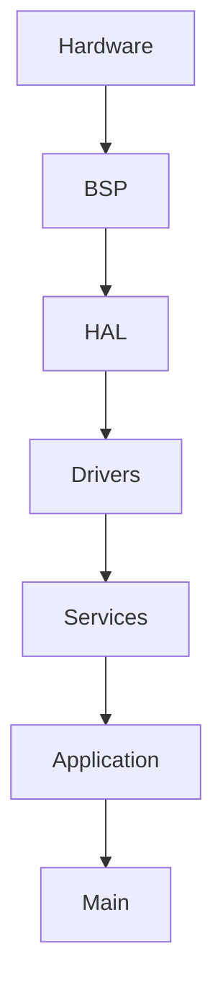

Dengan detail:

```mermaid
flowchart TD

MAIN[main.cpp]

BSP[Board BSP]

GPIO[GPIO HAL]
TIMER[Timer HAL]
I2C[I2C HAL]

SHIFT[Shift Register Driver]
SEG[Segment Encoder]
DISPLAY[Display Driver]
RTC[RTC Driver]
BUTTON[Button Driver]
LED[LED Driver]
BUZZER[Buzzer Driver]

SCHED[Scheduler]
EVENT[Event System]
TIME[Time Service]
NOTIFY[Notification Manager]

MODE[Mode Manager]
CLOCK[Clock Mode]
STOPWATCH[Stopwatch Mode]
COUNTDOWN[Countdown Mode]

UI[UI Controller]
FACTORY[Factory Mode]
DIAG[Diagnostic System]

MAIN --> BSP

MAIN --> GPIO
MAIN --> TIMER
MAIN --> I2C

MAIN --> SHIFT
MAIN --> SEG
MAIN --> DISPLAY
MAIN --> RTC
MAIN --> BUTTON
MAIN --> LED
MAIN --> BUZZER

MAIN --> SCHED
MAIN --> EVENT
MAIN --> TIME
MAIN --> NOTIFY

MAIN --> MODE

MODE --> CLOCK
MODE --> STOPWATCH
MODE --> COUNTDOWN

MAIN --> UI
MAIN --> FACTORY
MAIN --> DIAG
```

---

# 5. Important Architecture Rule

`main.cpp` harus tetap tipis.

Jangan menaruh:

```text
button debounce
stopwatch logic
countdown calculation
RTC register access
display segment encoding
buzzer pattern
mode transition logic
```

di dalam `main.cpp`.

Main hanya melakukan:

```text
initialization
dependency wiring
scheduler execution
system lifecycle
```

---

# 6. Application Startup

Startup harus deterministic.

Recommended:

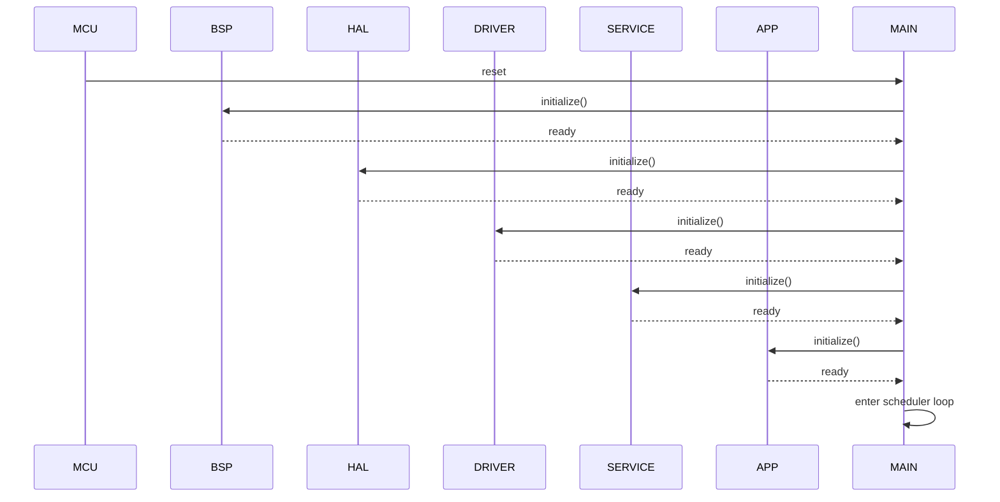

Jika dependency graph existing menentukan urutan berbeda, gunakan dependency aktual.

---

# 7. Startup Safety

Startup wajib memastikan:

```text
Buzzer = OFF
Display = disabled
Button = INPUT_PULLUP
LED = safe state
Shift register = known state
RTC = initialized
Scheduler = stopped until initialization complete
```

Tidak boleh terjadi:

```text
random digit
ghost display
unexpected buzzer
false button event
```

saat boot.

---

# 8. Initialization Order

Gunakan urutan berikut sebagai baseline:

```text
1. Board BSP
2. GPIO HAL
3. Timer HAL
4. I2C HAL
5. Shift Register Driver
6. Segment Encoder
7. Display Driver
8. RTC Driver
9. Button Driver
10. LED Driver
11. Buzzer Driver
12. Event System
13. Scheduler
14. Time Service
15. Notification Manager
16. Mode Manager
17. UI Controller
18. Factory Mode
19. Diagnostic System
20. Application startup
21. Scheduler start
```

Namun jangan membuat initialization dependency yang tidak diperlukan.

---

# 9. Dependency Rule

Jika sebuah module membutuhkan module lain:

```text
consumer
-->
dependency
```

dependency harus diberikan secara eksplisit.

Contoh:

```cpp
DisplayDriver display(
    shiftRegister
);
```

atau menggunakan existing architecture.

Jangan menggunakan global singleton jika tidak diperlukan.

---

# 10. Dependency Injection

Prioritaskan dependency injection sederhana.

Contoh:

```cpp
ButtonDriver buttonDriver(
    gpio
);
```

Kemudian:

```cpp
ModeManager modeManager(
    eventSystem,
    timeService,
    notificationManager
);
```

Hindari:

```cpp
ModeManager::instance()
```

kecuali memang sudah ditetapkan oleh architecture.

---

# 11. Memory Optimization

Arduino Nano hanya memiliki:

```text
SRAM = 2 KB
```

Karena itu integrasi harus sangat memperhatikan:

```text
SRAM
stack
global objects
temporary objects
buffer
event queue
```

---

# 12. Passing By Reference Rule

WAJIB mengikuti rule project:

> Jika variable, function, atau class menerima object/struct, prioritaskan passing by reference untuk menghemat resource/memory.

Gunakan:

```cpp
void process(
    const Event& event
);
```

bukan:

```cpp
void process(
    Event event
);
```

Untuk object yang dimodifikasi:

```cpp
void update(
    State& state
);
```

Untuk read-only:

```cpp
void render(
    const DisplayFrame& frame
);
```

Untuk primitive kecil:

```cpp
void setMode(
    Mode mode
);
```

boleh pass-by-value.

---

# 13. No Dynamic Allocation

DILARANG:

```cpp
new
delete
malloc
free
```

Main integration tidak boleh membuat dynamic allocation.

Semua dependency harus memiliki lifetime yang deterministic.

---

# 14. Object Lifetime

Gunakan static/global object hanya jika memang diperlukan.

Prefer:

```cpp
static BoardConfig ...
static Driver ...
static Service ...
```

dengan lifetime jelas.

Jangan membuat object besar di stack pada:

```text
loop()
event handler
callback
scheduler task
```

---

# 15. Main Object Strategy

Jika architecture menggunakan object-oriented design:

```text
main.cpp
```

boleh memiliki top-level objects.

Contoh:

```cpp
Board
GPIO
Timer
I2C
Display
RTC
Buttons
LED
Buzzer
Scheduler
EventSystem
TimeService
NotificationManager
ModeManager
UIController
FactoryMode
DiagnosticSystem
```

Tetapi hindari object yang tidak diperlukan.

---

# 16. Main.cpp Responsibilities

`main.cpp` hanya menangani:

```text
setup()
loop()
```

dan orchestration minimal.

Contoh struktur:

```cpp
void setup()
{
    initializeHardware();
    initializeDrivers();
    initializeServices();
    initializeApplication();
}

void loop()
{
    scheduler.run();
}
```

Jika scheduler architecture menggunakan `tick()`:

```cpp
void loop()
{
    scheduler.tick();
}
```

---

# 17. Do Not Poll Everything Manually

DILARANG membuat:

```cpp
void loop()
{
    button.update();
    rtc.update();
    stopwatch.update();
    countdown.update();
    display.update();
    buzzer.update();
    led.update();
    ui.update();
}
```

jika Scheduler sudah menjadi orchestrator.

Gunakan:

```text
Scheduler
-->
scheduled tasks
-->
services/drivers
```

---

# 18. Scheduler Integration

Scheduler harus menjadi timing backbone.

Contoh task:

```text
Display Refresh
Button Scan
RTC Update
Time Service
Stopwatch Tick
Countdown Tick
Notification Update
UI Update
Diagnostic Task
```

Jangan membuat delay blocking.

---

# 19. No delay()

DILARANG menggunakan:

```cpp
delay(...)
```

untuk application behavior.

Alasan:

```text
blocking
button latency
display multiplex interruption
buzzer timing interruption
scheduler starvation
```

Gunakan:

```text
Scheduler
Timer HAL
timestamp
event
```

---

# 20. Event System

Gunakan Event System untuk komunikasi antar module.

Contoh:

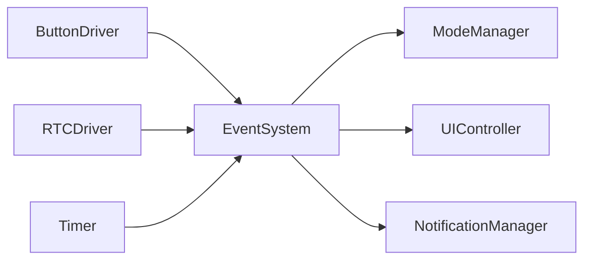

---

# 21. Event Ownership

Main Integration tidak boleh memproses event secara langsung.

Main hanya memastikan:

```text
EventSystem
-->
Scheduler
-->
Consumers
```

sudah terhubung.

---

# 22. Button Flow

Expected:


Untuk:

```text
short
hold
repeat
```

semua berasal dari Button Driver/Event System.

Jangan implement debounce di Mode Manager.

---

# 23. Button Mapping

Hardware:

```text
D4 = POWER
D5 = SELECT
D6 = NEXT
D7 = UP
D8 = DOWN
```

Semua:

```text
INPUT_PULLUP
```

Electrical active state:

```text
LOW
```

Gunakan BSP sebagai source of truth.

---

# 24. Display Flow

Display architecture:


Main tidak boleh membuat segment pattern.

---

# 25. Display Refresh

Display multiplex harus berjalan secara periodic.

Target:

```text
6 digit
```

dengan:

```text
74HC595 #1 = segment
74HC595 #2 = digit + colon/tick
```

Main tidak boleh mengontrol digit secara langsung.

---

# 26. Display Timing

Gunakan Timer HAL / Scheduler sesuai architecture.

Jangan:

```cpp
delayMicroseconds(...)
```

di main loop sebagai primary display scheduler.

---

# 27. RTC Flow

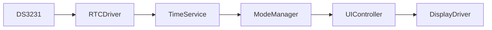

Main hanya melakukan initialization.

---

# 28. RTC Failure

Jika RTC gagal:

```text
RTC Driver
-->
error/event
-->
Diagnostic System / Notification Manager
```

Jangan membuat emergency handling langsung di `main.cpp`.

---

# 29. Time Service

Time Service menjadi abstraction untuk:

```text
current time
elapsed time
countdown time
tick
```

Main tidak menghitung:

```text
HH
MM
SS
```

---

# 30. Clock Mode

Clock Mode:

```text
24-hour
HH:MM:SS
```

Data berasal dari:

```text
TimeService / RTC
```

Display melalui:

```text
UIController
-->
DisplayDriver
```

---

# 31. Stopwatch Mode

Range:

```text
00:00:00
hingga
99:99:99
```

Tick:

```text
1 second
```

Main tidak boleh menyimpan stopwatch state.

State harus dimiliki:

```text
StopwatchMode
```

---

# 32. Countdown Mode

Range:

```text
99:99:99
hingga
00:00:00
```

Tick:

```text
1 second
```

Ketika mencapai:

```text
00:00:00
```

trigger event:

```text
COUNTDOWN_FINISHED
```

NotificationManager menangani notification.

---

# 33. Mode Manager

Mode Manager mengatur:

```text
CLOCK
STOPWATCH
COUNTDOWN
```

Main tidak boleh melakukan:

```cpp
if (mode == CLOCK)
```

untuk menjalankan mode.

---

# 34. UI Controller

UI Controller bertanggung jawab terhadap:

```text
display content
screen state
UI rendering
```

Main tidak boleh mengatur digit secara langsung.

---

# 35. Notification Manager

Notification Manager menangani:

```text
button feedback
save feedback
reset feedback
mode feedback
countdown finished
diagnostic notification
```

Buzzer dan LED tetap dikontrol oleh driver masing-masing.

---

# 36. Buzzer Flow


Buzzer:

```text
active LOW
```

Main tidak boleh:

```cpp
digitalWrite(Board::Pin::BUZZER, LOW);
```

---

# 37. LED Flow

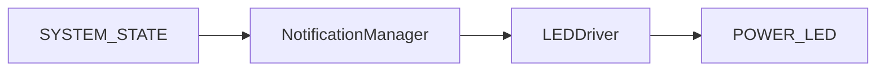

LED pin:

```text
D12
```

Polarity harus mengikuti BSP.

---

# 38. Factory Mode

Factory Mode harus dapat berjalan tanpa mengubah application mode.

Contoh:

```text
Factory Mode
    |
    +-- display test
    +-- button test
    +-- buzzer test
    +-- LED test
    +-- RTC test
```

Main hanya menginisialisasi FactoryMode.

Factory workflow tetap berada di FactoryMode.

---

# 39. Diagnostic System

Diagnostic System harus dapat memeriksa:

```text
MCU
RTC
Display
Buttons
Buzzer
LED
Firmware version
Hardware revision
```

Main tidak melakukan diagnostic logic.

---

# 40. Firmware Version

Firmware version berasal dari:

```text
Version.h
```

Format:

```text
MAJOR
MINOR
PATCH
BUILD
```

Main tidak boleh mendefinisikan versi sendiri.

---

# 41. Hardware Version

Hardware revision berasal dari:

```text
Board BSP
```

Pisahkan:

```text
Firmware Version
Hardware Revision
```

---

# 42. Production Identification

Diagnostic / Factory Mode harus mampu menyediakan informasi:

```text
Firmware Version
Hardware Revision
```

untuk production traceability.

---

# 43. Error Handling

Gunakan architecture:

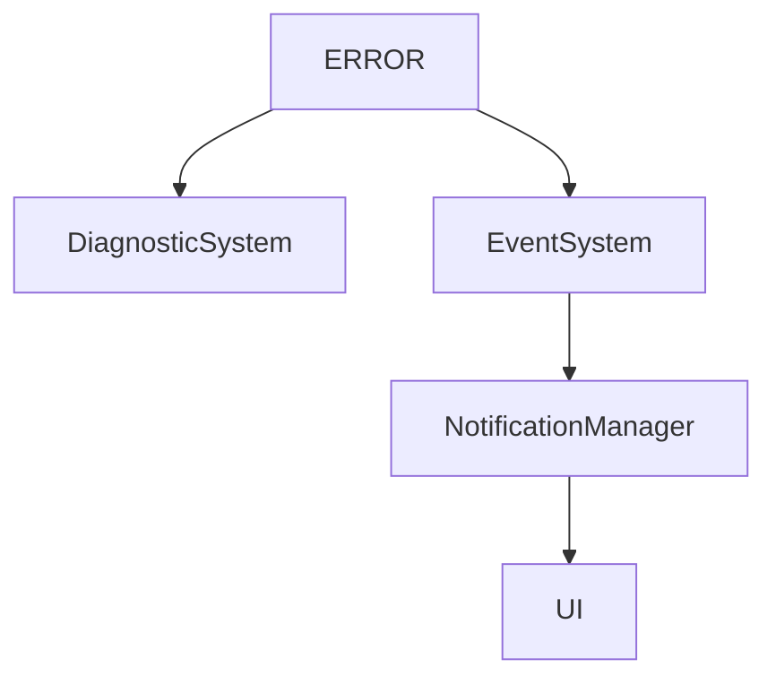

Jangan membuat:

```cpp
while(true)
{
}
```

untuk error biasa.

---

# 44. Fatal Error

Untuk kondisi fatal yang benar-benar tidak memungkinkan firmware berjalan:

```text
enter safe state
disable unsafe outputs
report diagnostic status
```

Tetapi jangan membuat watchdog reset loop tanpa alasan.

---

# 45. Watchdog

Jika project architecture menggunakan watchdog:

```text
Watchdog
-->
system health
-->
reset recovery
```

Main boleh menjadi lokasi kick watchdog.

Namun jangan kick watchdog secara buta jika scheduler macet.

Lebih baik:

```text
Scheduler healthy
-->
watchdog kick
```

---

# 46. Main Loop Health

Recommended:

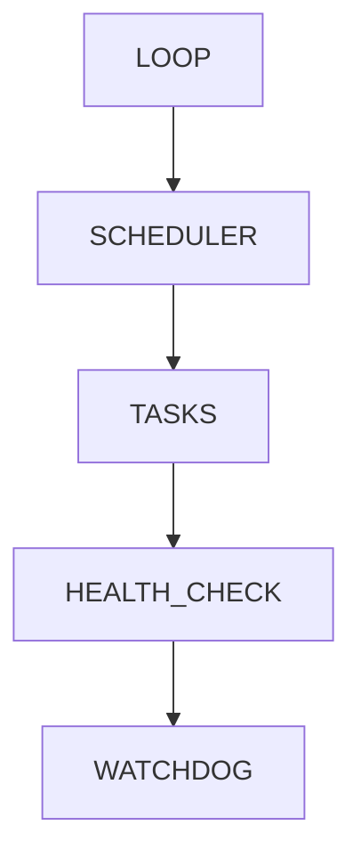

Jika watchdog digunakan.

---

# 47. Initialization Failure

Jika module initialization gagal:

```text
RTC
Display
I2C
```

jangan diam-diam menganggap sukses.

Gunakan:

```text
Status
Result
Error Event
Diagnostic
```

sesuai Common Library.

---

# 48. Result Handling

Jika project memiliki:

```text
StatusCode
Result
ErrorCode
```

gunakan existing type.

Jangan membuat:

```text
StatusCode2
ResultType
ErrorResult
```

yang duplikatif.

---

# 49. Global State

Minimalkan global mutable state.

DILARANG membuat:

```cpp
volatile bool stopwatchRunning;
volatile bool countdownRunning;
int currentMode;
int selectedDigit;
```

di `main.cpp`.

State harus dimiliki module terkait.

---

# 50. ISR Rule

Interrupt Service Routine harus sangat ringan.

ISR hanya:

```text
capture flag
increment counter
notify timer
```

Jangan:

```text
display rendering
button debounce
I2C transaction
buzzer sequence
mode transition
```

di ISR.

---

# 51. ISR and Main Communication

Jika ISR berkomunikasi dengan main/service:

gunakan:

```text
volatile flag
atomic-safe primitive
event flag
counter
```

sesuai architecture.

Jangan menggunakan object kompleks di ISR.

---

# 52. Interrupt Ownership

Baca:

```text
PROMPT_04_Timer_HAL.md
PROMPT_09_RTC_Driver.md
PROMPT_13_Scheduler.md
PROMPT_24_Board_BSP.md
```

Jangan membuat interrupt handler kedua untuk resource yang sudah dimiliki HAL.

---

# 53. Concurrency

ATmega328P adalah single-core.

Tetapi tetap perhatikan:

```text
ISR
main loop
shared state
volatile
atomicity
```

---

# 54. Critical Sections

Gunakan critical section hanya jika diperlukan.

Jangan men-disable interrupt dalam waktu lama.

DILARANG:

```text
disable interrupt
-->
I2C transaction
-->
display operation
-->
delay
-->
enable interrupt
```

---

# 55. Boot State

Default mode:

```text
CLOCK
```

kecuali dokumentasi UI/UX menetapkan behavior berbeda.

Default display:

```text
HH:MM:SS
```

24-hour.

---

# 56. Power Button

Power button behavior mengikuti:

```text
docs/05_Button_System.md
docs/13_UI_UX_Specification.md
```

Jangan membuat behavior baru di main.

---

# 57. Mode Transition

Flow:

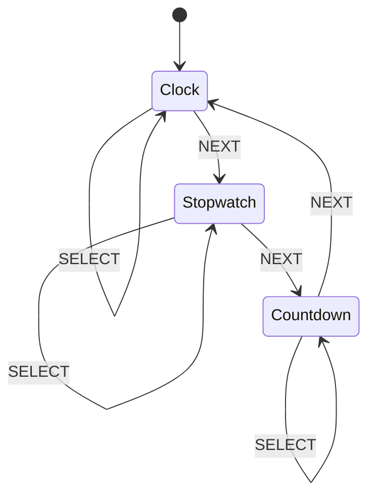

Gunakan actual state machine dari:

```text
docs/06_Mode_Manager.md
```

Jika berbeda, gunakan dokumentasi terbaru.

---

# 58. Button Event Flow

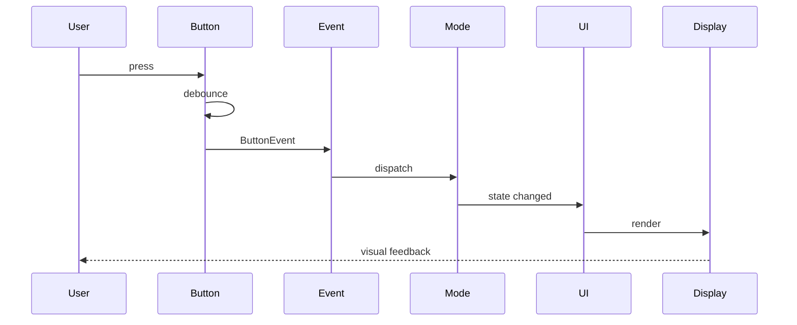

---

# 59. Scheduler Task Table

Buat task table berdasarkan architecture actual.

Contoh:

| Task            | Source          | Frequency      |
| --------------- | --------------- | -------------- |
| Display Refresh | Timer           | high frequency |
| Button Scan     | Scheduler       | periodic       |
| RTC Update      | RTC/Scheduler   | 1 sec          |
| Time Service    | Scheduler/Event | periodic       |
| UI Update       | Event/Scheduler | event driven   |
| Notification    | Scheduler       | periodic       |
| Diagnostics     | Scheduler       | low frequency  |

Jangan mengunci angka frequency tanpa membaca dokumentasi existing.

---

# 60. Event Driven Preference

Prioritaskan:

```text
event-driven
```

dibanding:

```text
continuous polling
```

jika tidak membutuhkan polling.

---

# 61. Polling Rule

Polling boleh digunakan untuk:

```text
button scan
hardware status
periodic diagnostics
```

jika diperlukan.

Tetapi polling harus:

```text
non-blocking
deterministic
scheduled
```

---

# 62. Main Integration API

Jika diperlukan buat class:

```cpp
class Application
{
public:
    bool initialize();
    void update();
};
```

Namun jika scheduler sudah menjadi architecture utama, gunakan:

```cpp
Application::initialize();
scheduler.run();
```

Jangan membuat abstraction tambahan tanpa kebutuhan.

---

# 63. Recommended Main

Contoh baseline:

```cpp
#include <Arduino.h>

#include "bsp/BoardConfig.h"
#include "hal/GpioHal.h"
#include "hal/TimerHal.h"
#include "hal/I2cHal.h"

#include "drivers/DisplayDriver.h"
#include "drivers/RtcDriver.h"
#include "drivers/ButtonDriver.h"
#include "drivers/LedDriver.h"
#include "drivers/BuzzerDriver.h"

#include "services/TimeService.h"
#include "services/NotificationManager.h"
#include "services/Scheduler.h"
#include "services/EventSystem.h"

#include "application/ModeManager.h"
#include "application/UIController.h"

void setup()
{
    // Initialize system in dependency order.
}

void loop()
{
    // Run scheduler.
}
```

Ini hanya template.

Gunakan nama file/class actual dari repository.

---

# 64. Main Must Stay Small

Target:

```text
main.cpp
```

harus mudah dibaca dalam satu layar jika memungkinkan.

Idealnya developer dapat memahami startup flow tanpa membaca business logic.

---

# 65. No Business Logic in main.cpp

DILARANG:

```cpp
if (buttonPressed)
{
    stopwatch.start();
}
```

atau:

```cpp
if (countdown == 0)
{
    buzzer.beep();
}
```

atau:

```cpp
if (mode == CLOCK)
{
    display.show(...);
}
```

Semua harus berada pada module yang sesuai.

---

# 66. Build Configuration

Gunakan:

```text
platformio.ini
```

yang telah dibuat oleh:

```text
PROMPT_00_Project_Setup.md
```

Jangan membuat environment baru tanpa alasan.

---

# 67. Library Dependency

Sebelum menambahkan library baru:

```text
1. cek apakah fungsi sudah tersedia
2. cek Common Library
3. cek existing HAL
4. cek PlatformIO dependency
5. baru pertimbangkan library external
```

Jangan menambahkan dependency untuk fungsi sederhana.

---

# 68. Third Party Library

Jika menggunakan library:

```text
DS3231
```

pastikan:

```text
Flash
SRAM
license
maintenance
compatibility
```

sesuai kebutuhan production.

Jika RTC driver sudah custom:

```text
gunakan existing RTC driver
```

jangan membuat dua implementation.

---

# 69. Code Duplication

Cari duplicate:

```text
pin mapping
timer
RTC handling
button logic
display encoding
mode state
version
```

Sebelum implementasi final.

---

# 70. API Stability

Jika module sebelumnya sudah memiliki API:

```text
jangan mengubah API
```

kecuali:

```text
1. salah secara architecture
2. menyebabkan resource problem
3. conflict dengan documentation
4. diperlukan untuk integration
```

Jika mengubah API:

```text
update semua consumer
```

dan dokumentasikan.

---

# 71. Memory Review

Setelah integration:

periksa:

```text
Flash usage
RAM usage
global/static allocation
stack-heavy functions
event queue
display buffer
temporary objects
```

Target:

```text
safe margin
```

Jangan hanya mengejar build success.

---

# 72. SRAM Optimization

Prioritas:

```text
1. no dynamic allocation
2. small integer types
3. constexpr
4. const
5. reference
6. static buffers
7. avoid duplicate state
8. avoid large local objects
9. avoid String
10. avoid unnecessary buffers
```

---

# 73. PROGMEM

Gunakan `PROGMEM` jika ada constant data besar yang tidak perlu berada di SRAM.

Contoh:

```text
diagnostic strings
font tables
static messages
```

Jangan menggunakan PROGMEM secara berlebihan untuk data kecil.

---

# 74. String Policy

DILARANG:

```cpp
String
```

Gunakan:

```cpp
const char*
```

atau:

```cpp
char[]
```

dan `PROGMEM` bila diperlukan.

---

# 75. Debug Logging

Debug logging harus:

```text
compile-time configurable
```

Contoh:

```cpp
#ifdef DEBUG
...
#endif
```

atau architecture logging existing.

Production build harus dapat menonaktifkan logging.

---

# 76. Serial Safety

Firmware harus tetap berjalan ketika:

```text
Serial Monitor tidak terhubung
```

Tidak boleh menunggu:

```cpp
while (!Serial)
{
}
```

---

# 77. Factory / Production Build

Pastikan build dapat membedakan:

```text
development
factory
production
```

jika architecture project menyediakan build flags.

Jangan hard-code production behavior ke main.

---

# 78. Watchdog Integration

Jika watchdog digunakan:

```text
initialize watchdog
-->
scheduler health
-->
kick watchdog
```

Jangan kick watchdog di setiap loop tanpa health validation.

---

# 79. System State

Jika diperlukan, buat:

```cpp
enum class SystemState : uint8_t
{
    BOOT,
    INITIALIZING,
    RUNNING,
    FACTORY,
    DIAGNOSTIC,
    ERROR
};
```

Tetapi gunakan existing Common/System state jika sudah tersedia.

---

# 80. Boot to Running

Expected:

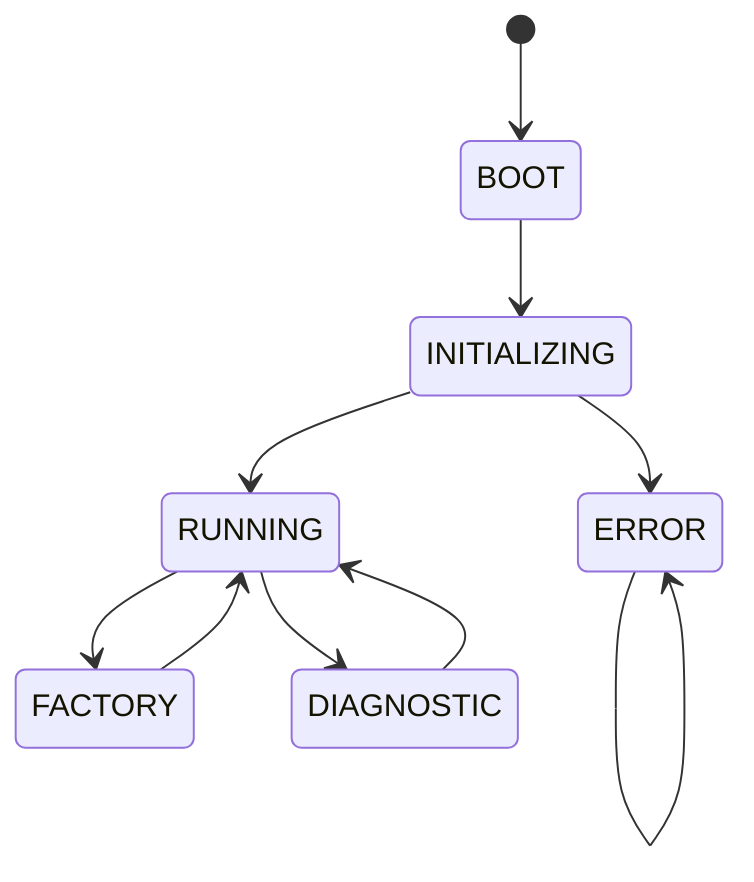

Sesuaikan dengan actual application architecture.

---

# 81. Error Recovery

Jika error recoverable:

```text
report
-->
notify
-->
continue safe operation
```

Jika non-recoverable:

```text
safe state
-->
diagnostic
```

---

# 82. Startup Diagnostic

Startup diagnostic tidak boleh mengganggu normal user experience terlalu lama.

Gunakan:

```text
Factory Mode
```

untuk hardware test mendalam.

---

# 83. Display Startup

Sebelum display driver ready:

```text
OE = disabled
```

Setelah driver ready:

```text
OE = enabled
```

sesuai active polarity.

---

# 84. Buzzer Startup

Pastikan:

```text
buzzer OFF
```

sebelum NotificationManager aktif.

---

# 85. Button Startup

Pastikan:

```text
INPUT_PULLUP
```

sudah aktif sebelum ButtonDriver melakukan scanning.

---

# 86. RTC Startup

RTC initialization harus:

```text
1. initialize I2C
2. initialize RTC
3. validate RTC
4. expose status
```

Jangan menganggap RTC selalu tersedia.

---

# 87. Scheduler Startup

Scheduler hanya mulai menjalankan task setelah:

```text
hardware initialization
-->
driver initialization
-->
service initialization
-->
application initialization
```

selesai.

---

# 88. Event Queue Startup

Event queue harus empty pada startup.

Jangan membawa event stale dari initialization.

---

# 89. Notification Startup

NotificationManager harus berada dalam:

```text
idle
```

state pada startup.

Tidak boleh menghasilkan beep kecuali startup beep memang didefinisikan oleh UI/UX specification.

---

# 90. Mode Startup

Default:

```text
CLOCK
```

jika tidak ada persisted mode requirement.

---

# 91. Persistence

Jangan menambahkan EEPROM persistence kecuali requirement project mengharuskannya.

Jika diperlukan:

```text
gunakan service khusus
```

bukan main.cpp.

---

# 92. EEPROM

Jika future requirement membutuhkan:

```text
settings
countdown preset
calibration
```

gunakan abstraction layer.

Jangan akses EEPROM langsung dari Main Integration.

---

# 93. Factory Calibration

Factory Mode boleh melakukan:

```text
hardware calibration
```

tetapi Main hanya mengintegrasikan.

---

# 94. Diagnostic Flow

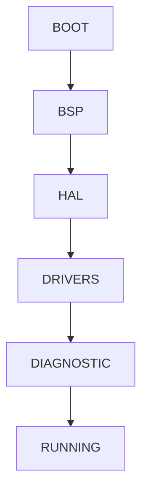

---

# 95. Integration Test

Setelah implementasi, lakukan test:

```text
1. Compile
2. Link
3. Upload
4. Boot
5. Display
6. Buttons
7. RTC
8. Buzzer
9. LED
10. Mode switching
11. Clock
12. Stopwatch
13. Countdown
14. Factory Mode
15. Diagnostic
```

---

# 96. Hardware Test

Minimal:

```text
Power ON
-->
LED
-->
Display
-->
RTC
-->
Button
-->
Buzzer
```

---

# 97. Button Test

Test:

```text
POWER short
POWER hold

SELECT short
SELECT hold
SELECT repeat

NEXT short
NEXT hold
NEXT repeat

UP short
UP hold
UP repeat

DOWN short
DOWN hold
DOWN repeat
```

Gunakan behavior yang didefinisikan pada:

```text
docs/05_Button_System.md
```

---

# 98. Stopwatch Test

Test:

```text
start
pause
resume
reset
overflow
99:59:59 boundary
```

Pastikan:

```text
99:59:59
```

tidak menghasilkan invalid value.

---

# 99. Countdown Test

Test:

```text
set
start
pause
resume
reset
zero
completion notification
```

Boundary:

```text
00:00:00
```

---

# 100. Clock Test

Test:

```text
00:00:00
23:59:59
00:00:00 rollover
```

Pastikan format:

```text
24-hour
```

---

# 101. Display Test

Test:

```text
000000
111111
222222
333333
444444
555555
666666
777777
888888
999999
```

dan:

```text
HH:MM:SS
```

Pastikan tidak ada:

```text
ghosting
wrong digit
wrong segment
colon error
multiplex flicker
```

---

# 102. RTC Failure Test

Simulasikan:

```text
I2C unavailable
RTC invalid
RTC disconnected
```

Pastikan system masuk ke behavior yang ditentukan Diagnostic System.

---

# 103. Button Noise Test

Test:

```text
bounce
long press
rapid press
multiple button
```

Pastikan tidak ada duplicate event.

---

# 104. Buzzer Test

Test:

```text
short beep
long beep
save
reset
mode
error
countdown complete
```

Tidak boleh blocking.

---

# 105. Long Run Test

Jalankan:

```text
minimum several hours
```

dan monitor:

```text
memory
display stability
RTC drift
button response
scheduler stability
watchdog
```

Jika memungkinkan:

```text
24h soak test
```

untuk production validation.

---

# 106. Memory Leak Test

Karena dynamic allocation dilarang, pastikan:

```text
SRAM usage stable
```

selama long-run.

---

# 107. Timing Test

Verifikasi:

```text
1-second tick
display refresh
button response
countdown accuracy
stopwatch accuracy
```

Tidak boleh bergantung pada:

```text
delay()
```

---

# 108. Main Integration Acceptance Criteria

Implementasi dianggap selesai jika:

* [ ] seluruh module terintegrasi
* [ ] dependency order benar
* [ ] `main.cpp` tetap tipis
* [ ] tidak ada business logic di `main.cpp`
* [ ] tidak ada `delay()`
* [ ] tidak ada dynamic allocation
* [ ] tidak ada `String`
* [ ] tidak ada STL
* [ ] reference passing digunakan untuk object/struct
* [ ] `const&` digunakan untuk read-only object
* [ ] scheduler menjadi timing backbone
* [ ] event system digunakan untuk inter-module communication
* [ ] mode logic tetap berada di ModeManager
* [ ] UI logic tetap berada di UIController
* [ ] RTC logic tetap berada di RTCDriver
* [ ] display logic tetap berada di DisplayDriver
* [ ] button logic tetap berada di ButtonDriver
* [ ] buzzer logic tetap berada di BuzzerDriver
* [ ] LED logic tetap berada di LEDDriver
* [ ] notification logic tetap berada di NotificationManager
* [ ] diagnostic logic tetap berada di DiagnosticSystem
* [ ] factory logic tetap berada di FactoryMode
* [ ] BSP tetap menjadi source of truth hardware
* [ ] version berasal dari Version.h
* [ ] hardware revision berasal dari BSP
* [ ] startup safe state benar
* [ ] watchdog terintegrasi jika diperlukan
* [ ] PlatformIO build berhasil
* [ ] unit test berhasil jika tersedia
* [ ] integration test berhasil
* [ ] SRAM diperiksa
* [ ] Flash diperiksa
* [ ] tidak ada resource conflict
* [ ] documentation diperbarui

---

# 109. Documentation Update

Jika terdapat perubahan architecture selama integration, update dokumentasi yang relevan:

```text
docs/09_Firmware_Architecture.md
docs/11_Project_Structure.md
docs/12_Testing_Checklist.md
```

dan dokumentasi module yang terkena dampak.

Jangan membiarkan code dan documentation berbeda.

---

# 110. Architecture Improvement Rule

Jika selama integration ditemukan peningkatan arsitektur yang jelas:

```text
langsung implementasikan
```

jika:

* tidak mengubah hardware
* tidak merusak API
* mengurangi memory
* mengurangi coupling
* meningkatkan reliability
* meningkatkan deterministic behavior
* sesuai dokumentasi project

Setelah itu:

```text
update dokumentasi terkait
```

dan laporkan perubahan tersebut.

---

# 111. Do Not Over-Engineer

Arduino Nano memiliki resource terbatas.

Jangan menambahkan:

```text
dependency injection framework
RTOS
event bus framework
large abstraction framework
complex state machine library
dynamic containers
```

kecuali benar-benar diperlukan.

Gunakan architecture sederhana:

```text
HAL
-->
Driver
-->
Service
-->
Application
```

---

# 112. Final Code Quality

Code harus:

```text
readable
deterministic
testable
modular
memory efficient
production oriented
```

Prioritas:

```text
Safety
-->
Correctness
-->
Determinism
-->
Reliability
-->
Memory efficiency
-->
Maintainability
-->
Performance
```

---

# 113. Final Verification

Setelah selesai:

### A. Repository

Periksa:

```text
duplicate files
duplicate classes
duplicate pin definitions
unused code
unused include
unused globals
```

### B. Build

Jalankan:

```bash
pio run
```

### C. Test

Jalankan:

```bash
pio test
```

jika test environment tersedia.

### D. Memory

Laporkan:

```text
RAM
Flash
```

### E. Integration

Verifikasi:

```text
BSP
HAL
Drivers
Services
Application
Main
```

---

# 114. Final Report

Setelah implementation selesai, tampilkan:

```text
1. Files created
2. Files modified
3. Files removed
4. Dependency graph
5. Initialization sequence
6. Scheduler task list
7. Event flow
8. Mode flow
9. Hardware resource ownership
10. Memory usage
11. Flash usage
12. Build result
13. Test result
14. Architecture improvements
15. Documentation updates
16. Remaining issues
```

---

# 115. Critical Rule

Jangan menganggap project selesai hanya karena:

```text
pio run
```

berhasil.

Firmware harus:

```text
compile
-->
link
-->
run
-->
behave correctly
-->
respect hardware
-->
respect architecture
-->
respect memory constraints
-->
be testable
-->
be production ready
```

---

# 116. Final Instruction

Implementasikan Main Integration berdasarkan seluruh dokumentasi project.

Jangan membuat architecture baru jika architecture yang ada sudah benar.

Jika menemukan:

```text
conflicting requirement
duplicate implementation
wrong dependency
memory problem
pin conflict
timer conflict
API conflict
```

identifikasi dan selesaikan secara sistematis.

Setelah semua selesai:

```text
BUILD
-->
TEST
-->
REVIEW
-->
DOCUMENT
-->
REPORT
```

Jangan berhenti hanya setelah membuat `main.cpp`.

# END OF PROMPT

```
```
